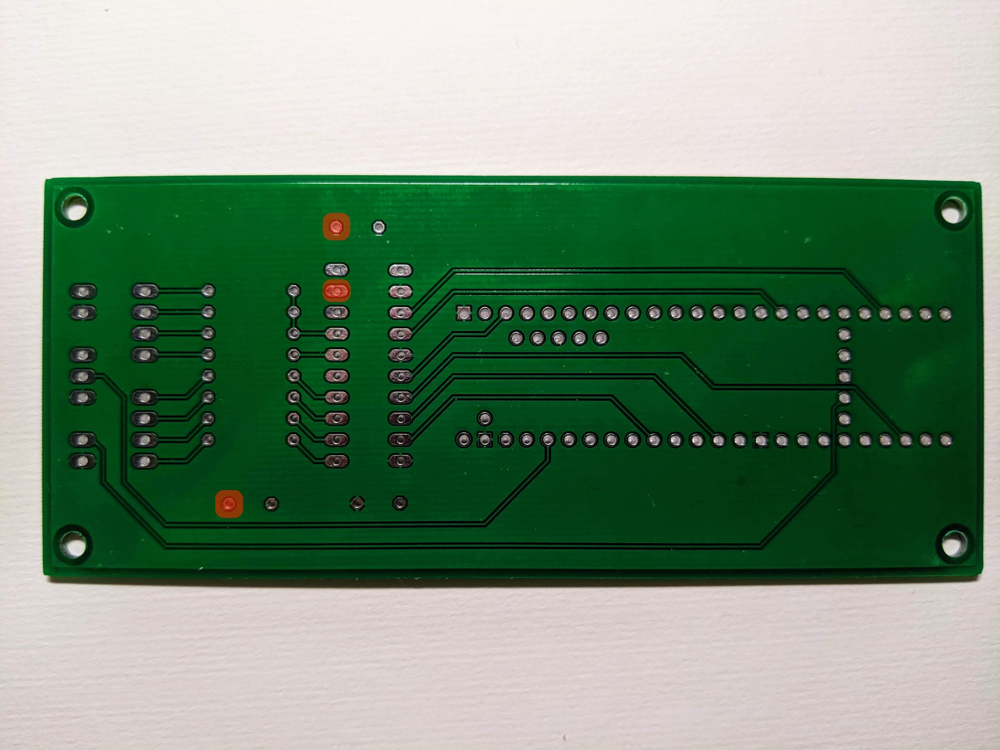

# Changelog
All notable changes to this project will be documented in this file.

The format is based on [Keep a Changelog](https://keepachangelog.com/en/1.0.0/),
and this project adheres to [Semantic Versioning](https://semver.org/spec/v2.0.0.html).

## [1.4.0] (2025-01-12)
### Changed
- Updated documentation
- Bumped version to 1.4.0

## [1.4.0-beta2] (2025-01-11)
### Changed
- Renamed `Palette` to `Gradient`.
- Fixed bugs `Strip` boundaries calculation.
  
### Added
- Implemented `CRGB Gradient::getRandomColor(uint16_t maxColors)` method.
- Implemented `Sunset` effect.
- Implemented `Scan` effect.

## [1.4.0-beta1] (2025-01-07)
### Changed
- BREAKING CHANGE: `Strip` changed `paint` methods signature: "add" is now required.

### Added
- Implemented Palette and paint methods supporting a palette instead of a single color

## [1.3.0] (2024-01-03)
### Changed
- Updated documentation
- Bumped version to 1.3.0

## [1.3.0-beta4] (2025-01-03)

### Changed
- BREAKING CHANGE: `Strip` changed `overlay` method signature: opacity is now a double (from 0 to 1).
- `Multiplex` increased number of multiplexed effects to 20.

## [1.3.0-beta3] (2025-01-02)

### Changed
- BREAKING CHANGE: Simplified definition of physical strips. It's no more necessary to create CRGBArray(s) and to register them using FastLED.addLeds().
- `Traffic` improved effect.
- Grouped strip-related classes.
- Grouped audio-related classes.
- Removed examples, now in separate repositories.
- Removed unnecessary #includes.

### Added
- Added dummy main.cpp, for a clean compilation.
  
## [1.3.0-beta1] (2024-12-28)

### Fixed
- `Interval`: implemented rolling arguments for `toTriangle`, `toSquare` and `toWave` functions.
- `Strip`: implemented double index arguments internally clipped and converted to int16_t, to avoid rollover.
- `Strip`: removed (a lot of) redundant code in subclasses.
- `Strip`: calculation of pixel range in mirrored mode.

### Changed
- BREAKING CHANGE: replaced all `float` variables and arguments with `double`.
- BREAKING CHANGE: `Strip` renamed method `buffered` to `overlay`.
- BREAKING CHANGE: `Stage` method `addStrip` has now the same signature as `PhysicalStrip`.
- `Interval`: changed time precision to microseconds.
- FastLED has been upgraded to version 3.9.8
- IRMP has been upgraded to version 3.6.4
- Reimplemented system effects

### Added
- `Controller`: implemented `setAudioEnabled(bool enabled)` and `toggleAudio()` for muting/unmuting.
- `Strip`: implemented `getIndex(int16_t index)` and `getPosition(double pos)` for reading CRGB color value.
- `ColorTwinkles`: ported Pixelblaze fx.
- `SubtleWave`: ported Pixelblaze fx.
- `Sparks` effect.
- `Traffic` effect.

## [1.2.14] (2022-04-19)

### Fixed
- `Stage`: added missing includes

## [1.2.13] (2021-12-11)

### Fixed
- `DeepSpace`: fixed a bug occurring on last pixel (normalized position 1).

## [1.2.12] (2021-12-09)

### Fixed
- `Controller`: fixed EEPROM persistence of param value.

### Changed
- `HarmonicMotion`: implemented `setCriticalDamping(float cf)` correction factor (default = 1).
- `Elastic`: updated fx using critical damping correction factor.

### Added
- `Interval`: added compatibility layer for easier porting of Pixelblaze-style effects.
- `RainbowMelt`: ported Pixelblaze fx.
- `RippleReflections`: ported Pixelblaze fx.

## [1.2.11] (2021-12-03)

### Fixed
- `JoinedStrip`: fixed probable cause of momentary random freezing / crashing.
- `JoinedStrip, ReversedStrip, SubStrip, StatefulStrip`: fixed upper boundary of random position.

### Changed
- Skipped first EEPROM location, where speed for each effect is stored, as location 0 seems not to work.

### Added
- `Motion`: added class for handling linear/accelerated motion.

## [1.2.10] (2021-04-11)

### Fixed
- `Timer`: fixed potential cause of momentary random freezing.

## [1.2.9] (2021-03-25)

### Changed
- Increased minimum brightenss from 10 to 20.
- `Vertigo`: reduced inhibit time.

### Added
- `Controller`: implemented `setBrightness` method for setting initial brightness.
- `Ripple`: added optional constructor argument for setting brightness color.
- `Background`: implemented basic effect for rendering a solid background.

## [1.2.8] (2021-03-19)

### Fixed
- `Matrix` effect: fixed wrong index boundary.

### Changed
- `Spectrum` effect: reimplemented using band peak detectors.
- `State`: merged distinct `slowRotatingHue` and `fastRotatingHue` into a `rotatingHue`.
- `Blackout` effect: forced strip clearing at every loop.

### Added
- `AudioChannel`: implemented individual peak, peakSmooth, peakHold and peakDetected for 16 frequency bands.
- `Controller`: implemented confugurable stats and standby timers.
- `VU2` effect: implemented configurable color.
- `Scroller` effect: implemented audio-reactive choking.

## [1.2.7] (2021-02-26)

### Fixed
- Fixed examples.

### Changed
- Allowed `addFx()` method to add up to 9 effect.

## [1.2.6] (2021-02-26)

### Changed
- Moved Strip implementations code to [src/strip](src/strip) directory. This change requires updating the #include directives in your stage implementation for any subclass of Strip (e.g. `#include "PhysicalStrip.h"` becomes `#include "strip/PhysicalStrip.h"`, etc.)
- Changed from FFT256 to FFT1024.
- Reimplemented Scroller using dominant frequency information.
- Reimplemented Spectrum using FFT bands instead of FFT bins.

### Added
- Implemented FFT bands and dominant band.
- Implemented EllipticMotion class for implementing 2D effects based on rotating objects.
- Implemented Spiral effect.

## [1.2.5] (2021-02-23)

### Fixed
- Fixed Fx flush method.

### Changed
- Replaced Strip method `void sanitize(int16_t &indexFrom, int16_t &indexTo)` with `bool crop(int16_t &indexFrom, int16_t &indexTo)`, which restricts the given range into the visible range only when the given range overlaps with the visible range. In that case it returns true, otherwise false.

## [1.2.4] (2021-02-22)

### Added
- Adopted [Keep a Changelog](https://keepachangelog.com/en/1.0.0/).

## [1.2.3]

### Changed
- Replaced cryptic PCB connector labels (J1, J2, J3, etc.) with more human-frendly ones (POWER, LEDS, IR-RECV, etc).

## [1.2.2]

### Fixed
- Fixed various bugs triggered by corner cases, especially when using JoinedStrip.
- Fixed a bug in HarmonicMotion caused by a wrong assignment.

### Added
- `Multiplex`
    - Increased the number of multiplexed effects to 9.
- `HarmonicMotion`
    - Added methods for random positioning:
        - `setFixedPointRandomPosition()`
        - `setRandomPosition()`
- Implemented new simple effect `Bounce`.

## [1.2.1]

### Fixed
- `JoinedStrip`
    - Fixed various bugs.

## [1.2.0]

### Changed
- `AudioChannel`
    - Method `trigger` has been removed and its functionality is now provided by `AudioTrigger`.
- `Trigger`
    - Replaced by `AudioTrigger`.

### Fixed
- `Strip`
    - Fixed `paintNormalizedSize` method.
- `JoinedStrip`
    - Fixed `paint` method when indexFrom falls in strip 1 and indexTo falls in strip 2.
    - Gap has been replaced with a `StatefulStrip`, so that its behavior is consistent with the visible portion of the strip.

### Added
- `Strip`
    - Implemented `buffered` method for creating a buffered version of a Strip, useful for those effects which alter the underlying Strip using blur, fade, shift, etc.
- Implemented new Strip implementation `SubStrip` for addressing a portion of another Strip.
- Implemented `AudioTrigger` for allowing beat detection over more than one loop, independently for concurrent effects.
    - The `triggered` method returns true if a beat was detected since the last call (or since the last call to the reset method).
    - Optionally, random triggers can be added (separately for signal detected or not), specifying the number of desired events per second.
- `AudioSensor`
    - implemented a separate low-pass-filtered RMS sensor for feeding the beat detector, which now responds to low frequencies only.
- `Fx`
    - implemented `strip`, `audioChannel` and `state` as protected members, so that they don't need to be redefined for each effect implementation.
- `Matrix` fx
    - Reimplemented without timers, for maximum smoothness.
- `PeakMeter` fx
    - Reduced flashing on beat detected.
- `VU2` fx
    - Implemented new effect.

## [1.1.5]

### Fixed
- `AudioChannel`
    - Fixed wrong number of FFT bins, now 128 (it was 40).

## [1.1.4]

### Fixed
- `DeepSpace` fx
    - Fixed bug causing freezing under certain circumstances.
    - Set a minimum for number of items (instead of zero).

### Added
- `AudioChannel`
    - Allowed trigger to accumulate beat detection over multiple loops.
- `Controller`
    - Added methods for presetting input (line or mic) and level.
- `Brightness`
    - Reduced minimum brightness.
- IRMP library
    - Updated to version 3.4.0.
- `ColorBar` fx
    - Added extremely simple, static, single color effect.
- `SpeedMeter` fx
    - Changed background color to pure blue to avoid color deviations.
- `Fire` fx
    - Improved sound responsiveness.
- `Matrix` fx
    - Improved sound responsiveness.
- `Strobe` fx
    - Replaced color palette.

## [1.1.3]

### Fixed
- Circuit for Teensy 4.1 has been fixed.

    Previous version contained a serious flaw. Three pads, which looked grounded in the schematics, actually were not.
    In particular, one of these caused the OE input ("output enable") of the level shifter (74HCT245) to be floating and thus in undefined state.

    This caused the LED strip to freeze at random times.

    In case you have already ordered your PCB and it's too late to cancel, the simplest fix is to scratch a bit the solder mask around those three pads and solder to the pin.
    Given all unused copper is grounded, this would effectively connect those pins to ground, as shown in red in the picture (bottom view).

    I apologize for this.

    

## [1.1.2]

### Added
- `Controller`
    - Allowed direct effect selection to enter play mode (e.g. when pressing a number on the remote).
- `DeepSpace` fx
    - implemented direction changes.
- `Juggle`
    - Implemented speed adjustment.

## [1.1.1]

### Fixed
- `JoinedStrip`
    - Bypassed buffer when distance is zero.

## [1.1.0]

### Changed
- `HarmonicMotion`
    - Dropped method `getNormalizedPosition`.
- `Strip`
    - Turned into abstract class, with three concrete implementations:
        - `PhysicalStrip(CRGBSet &leds, uint16_t density)`
        - `ReversedStrip(Strip *strip)`
        - `JoinedStrip(Strip *strip1, Strip *strip2, uint16_t distance = 0)`
    - Replaced public members `leds`, `count` and `lenght` with public getters.
    - Renamed method `fill` to `paint`, with optional `add` argument.
    - Renamed method `fullRainbow` to `rainbow`, with optional `deltaHue` argument.
    - Removed method `randomPos` method, replaced by `random`.
    - Renamed method `randomPosRange` to `randomInRange`.
    - Renamed method `randomPosExclude` to `randomExclude`.
    - Renamed method `centerPos` to `center`.
    - Renamed method `lastPos` to `last`.
    - Removed method `toPosition`.
    - Renamed method `toNormalizedPosition` to `fromNormalizedPosition`.
- `Photons` fx
    - Reimplemented using HarmonicMotion.

### Added
- `Strip`
    - Implemented method `blur`.
    - Implemented method `first`.
    - Implemented method `size`.
    - Implemented method `paint` for single pixel.
    - Implemented method `paintNormalized` for single pixel.

## [1.0.0]

### First public release
